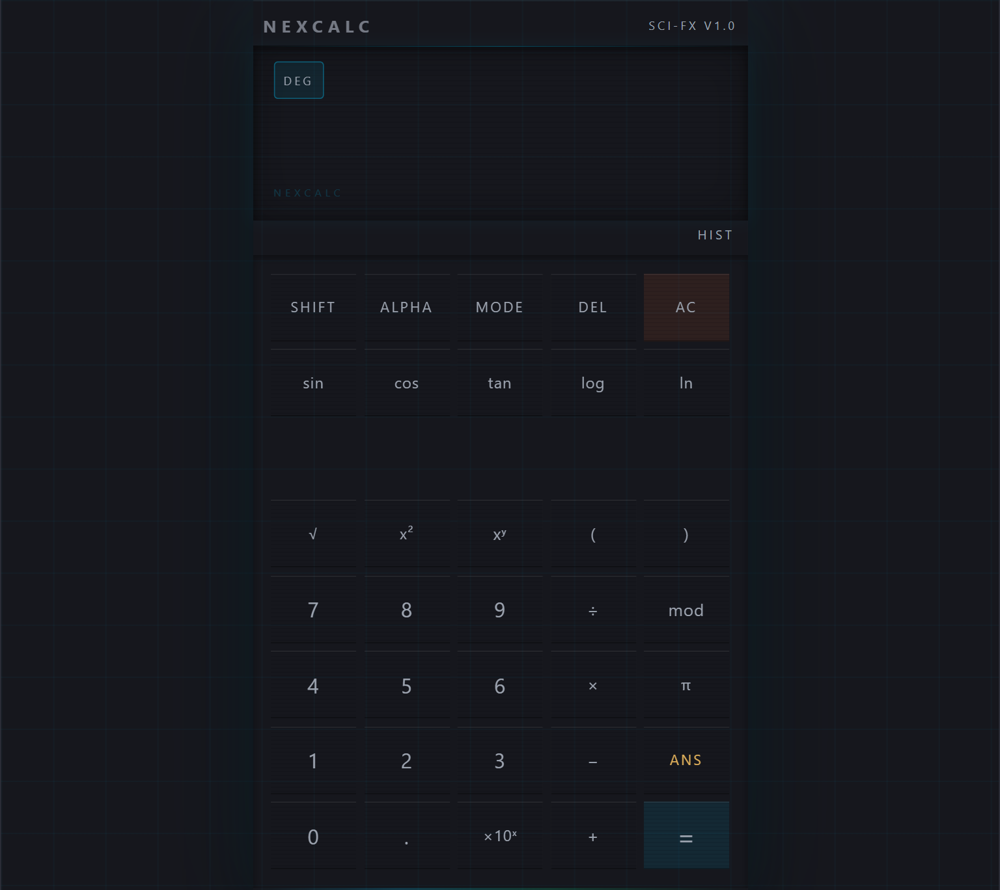

# NEXCALC — Scientific Calculator

A futuristic sci-fi scientific calculator built with React 19. This is a learning project exploring core modern React concepts including `useReducer`, `useContext`, custom hooks, and component composition.

**[Live Demo →](https://mahmudajahan99.github.io/NexCalc/)**

---

---

## Features

- Full scientific calculator — trig functions, logarithms, powers, roots, and more
- DEG / RAD / GRAD angle mode toggle
- ANS key — recall the last result in any expression
- Calculation history with timestamps, stored in localStorage
- Keyboard support — type expressions directly from your keyboard
- Animated display with entry/result transitions via Framer Motion
- Sci-fi aesthetic — cyan and green accents on a deep navy dark theme

---

## React Concepts Practiced

| Concept | Where it appears |
|---|---|
| `useReducer` | `calculatorReducer.js` — the entire calculator state machine |
| `useContext` + split contexts | `CalculatorStateContext` and `CalculatorActionsContext` — prevents unnecessary re-renders |
| Custom hooks | `useCalculator`, `useKeyboard`, `useHistory`, `useHistorySync` |
| `useEffect` + cleanup | `useKeyboard` — attaches and removes the global keydown listener |
| `useRef` | `useHistory` — skips the first-render localStorage write |
| `useCallback` + `useMemo` | `CalculatorContext` — stable action references and memoized state |
| Component composition | `CalcKey` — one component renders every button via props |

---

## Tech Stack

| Tool | Purpose |
|---|---|
| React 19 | UI framework |
| Vite | Build tool and dev server |
| Math.js | Safe expression parsing and evaluation |
| Framer Motion | Button and display animations |
| CSS Modules | Scoped component styles |
| Vitest | Unit testing |
| ESLint + Prettier | Code quality |

---

## Keyboard Shortcuts

| Key | Action |
|---|---|
| `0–9` | Input digits |
| `+ - * /` | Operators |
| `Enter` or `=` | Evaluate |
| `Backspace` | Delete last character |
| `Escape` or `Delete` | Clear (AC) |
| `( )` | Parentheses |
| `.` | Decimal point |

---

## 👩‍💻 Author

Mahmuda Jahan. Built as Project of a React 19 learning journey.

---

## License

MIT
